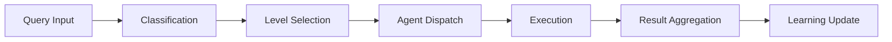

# HEKAT L1-L7 Architecture Specification

**Version**: 1.0.0
**Date**: 2025-11-17
**Status**: Formal Architecture Specification

---

## Executive Summary

HEKAT implements a **seven-level complexity hierarchy** for agent orchestration, where each level (L1-L7) represents a distinct coordination pattern optimized for specific token budgets and task complexities. The architecture enables automatic level selection based on query analysis, token constraints, and historical success patterns.

---

## 1. Architectural Overview

### 1.1 Core Concept

```
Query → Classification → Level Selection → Execution → Learning
```

Each level represents a **coordination archetype**:
- **L1-L3**: Sequential patterns (single chain)
- **L4**: Parallel consensus (multiple perspectives)
- **L5**: Hierarchical supervision (gated stages)
- **L6**: Iterative refinement (feedback loops)
- **L7**: Full ensemble (all patterns combined)

### 1.2 Design Principles

1. **Token-Aware**: Each level optimized for specific token budget
2. **Pattern-Based**: Coordination patterns, not agent counts
3. **Learning-Enabled**: Consciousness improves classification
4. **Fallback-Ready**: Graceful degradation when constrained
5. **Hotkey-Accelerated**: Quick access through keyboard shortcuts

---

## 2. Level Specifications

### 2.1 L1: Ultra-Fast Single-Hop

**Pattern**: Single agent, no coordination
**Token Budget**: 600-1,200 tokens
**Use Cases**: Quick explanations, simple lookups, direct answers

```yaml
Characteristics:
  agents: 1
  coordination: none
  latency: < 5 seconds
  success_rate: 95%+

Token Distribution:
  query_context: 100
  agent_dispatch: 150
  agent_execution: 300-700
  output_extraction: 50-100

Examples:
  - "explain JWT"
  - "what is PostgreSQL"
  - "list Python frameworks"
```

### 2.2 L2: Fast Simple-Chain

**Pattern**: Two agents in sequence
**Token Budget**: 1,500-3,000 tokens
**Use Cases**: Two-step workflows, research-then-document

```yaml
Characteristics:
  agents: 2
  coordination: sequential (A -> B)
  latency: < 15 seconds
  success_rate: 90%+

Token Distribution:
  query_context: 200
  agent_A: 600-800
  extraction: 200-300
  agent_B: 500-900
  final_output: 100-200

Examples:
  - "research then document X"
  - "design then implement Y"
  - "analyze then fix Z"
```

### 2.3 L3: Balanced Sequential

**Pattern**: Three agents in sequence
**Token Budget**: 2,500-4,500 tokens
**Use Cases**: Complete feature development, standard TDD

```yaml
Characteristics:
  agents: 3
  coordination: sequential (A -> B -> C)
  latency: < 30 seconds
  success_rate: 85%+

Token Distribution:
  query_context: 300
  agent_A: 600 (design)
  extraction_A: 200
  agent_B: 700 (implementation)
  extraction_B: 300
  agent_C: 400 (testing)
  final_extraction: 200

Examples:
  - "build authentication endpoint"
  - "create CRUD API"
  - "implement data pipeline"
```

### 2.4 L4: Parallel Consensus

**Pattern**: 2-3 agents in parallel, consensus merge
**Token Budget**: 3,000-6,000 tokens
**Use Cases**: Multi-perspective analysis, comparison, evaluation

```yaml
Characteristics:
  agents: 2-3
  coordination: parallel (A || B || C)
  latency: < 20 seconds
  success_rate: 88%+

Token Distribution:
  query_context: 400
  smart_duplicate: 600
  parallel_execution: 3×1200 (local)
  consensus_merge: 1200
  final_extraction: 200

Examples:
  - "compare framework options"
  - "evaluate architectural choices"
  - "review from multiple angles"
```

### 2.5 L5: Hierarchical Multi-Stage

**Pattern**: Supervisor-coordinated stages
**Token Budget**: 5,500-9,000 tokens
**Use Cases**: System architecture, complex planning

```yaml
Characteristics:
  agents: 4-5
  coordination: hierarchical (research -> supervise -> implement)
  latency: < 60 seconds
  success_rate: 87%+

Token Distribution:
  query_context: 500
  stage_1_parallel: 2000
  extraction_merge: 800
  supervisor: 1500
  stage_2_parallel: 2000
  final_orchestration: 500

Examples:
  - "design microservices architecture"
  - "plan deployment strategy"
  - "architect data platform"
```

### 2.6 L6: Deep Iterative Refinement

**Pattern**: Feedback loops with convergence
**Token Budget**: 8,000-12,000 tokens
**Use Cases**: Bug fixing, optimization, test-driven development

```yaml
Characteristics:
  agents: 4-6
  coordination: iterative (loop until condition)
  latency: < 120 seconds
  success_rate: 91%+

Token Distribution:
  query_context: 600
  iteration_1: 3000
  iteration_2: 2500
  iteration_3: 1500
  convergence_check: 500
  final_extraction: 300

Examples:
  - "fix memory leak with tests"
  - "optimize algorithm performance"
  - "refactor until clean"
```

### 2.7 L7: Full Ensemble Synthesis

**Pattern**: All coordination patterns combined
**Token Budget**: 12,000-22,000 tokens
**Use Cases**: Complete platform development, greenfield projects

```yaml
Characteristics:
  agents: 7+
  coordination: mixed (parallel + hierarchical + sequential)
  latency: < 180 seconds
  success_rate: 94%+

Token Distribution:
  query_context: 800
  stage_1_parallel_research: 3500
  synthesis: 4000
  stage_2_parallel_implement: 2500
  final_orchestration: 2000
  streaming_updates: 500

Examples:
  - "build complete SaaS platform"
  - "create production system"
  - "develop from scratch"
```

---

## 3. Level Selection Algorithm

### 3.1 Classification Pipeline

```python
def classify_complexity(query: Query) -> Level:
    # Step 1: Keyword Analysis
    level = keyword_classifier(query.text)

    # Step 2: Consciousness Pattern Matching
    if historical_match := find_similar_query(query):
        level = adjust_for_history(level, historical_match)

    # Step 3: Token Budget Constraints
    while not fits_in_budget(level, query.available_tokens):
        level = downgrade_level(level)

    # Step 4: Confidence Scoring
    confidence = calculate_confidence(level, query)

    return Level(
        number=level,
        confidence=confidence,
        reasoning=generate_reasoning()
    )
```

### 3.2 Keyword Mapping

```yaml
L1_keywords: [explain, what, how, tell, show, list]
L2_keywords: [then, and_then, two-step, research_and]
L3_keywords: [build, create, implement, develop]
L4_keywords: [compare, evaluate, analyze, perspectives]
L5_keywords: [architect, design_system, infrastructure]
L6_keywords: [fix, debug, iterate, refine, optimize]
L7_keywords: [platform, complete, production, from_scratch]
```

### 3.3 Consciousness Integration

```yaml
Pattern_Storage:
  format: YAML
  location: ~/.claude/hekat-consciousness.yaml

  fields:
    - query_pattern
    - selected_level
    - success_rate
    - sample_count
    - agents_used
    - token_variance

  matching:
    - semantic_similarity > 0.7
    - recency_weight: exponential_decay
    - confidence_boost: sample_count * success_rate
```

---

## 4. Hotkey Architecture (TIER System)

### 4.1 TIER 1: Single Keys

```
[R]esearch    [D]esign     [T]est      [B]uild
[F]rontend    [I]mplement  [O]rchest   [S]ynth
[C]ode-review [P]arallel   [V]erify    [A]nalyze
```

### 4.2 TIER 2: Complexity Modifiers

```
[Ctrl+P] → L4 Parallel
[Ctrl+H] → L5 Hierarchical
[Ctrl+I] → L6 Iterative
[Ctrl+E] → L7 Ensemble
```

### 4.3 TIER 3: Chain Patterns

```
Sequential:  [R>D>I] (Research → Design → Implement)
Parallel:    [P:R||D||A] (Research || Design || Analyze)
Complex:     [H:R+D→O] (Research + Design → Orchestrate)
```

---

## 5. Execution Architecture

### 5.1 Pipeline Stages



### 5.2 Token Management

```python
class TokenManager:
    def allocate(self, level: Level) -> TokenAllocation:
        base_budget = LEVEL_BUDGETS[level]

        return TokenAllocation(
            query_context=base_budget.context,
            agent_execution=base_budget.agents,
            extraction=base_budget.extraction,
            overhead=base_budget.overhead,
            reserve=base_budget.reserve * 0.1
        )

    def track(self, phase: Phase) -> TokenDelta:
        pre = self.current_tokens
        yield  # Execute phase
        post = self.current_tokens

        return TokenDelta(
            phase=phase,
            consumed=post - pre,
            remaining=self.budget - post
        )
```

### 5.3 Fallback Strategies

```yaml
Insufficient_Tokens:
  strategy: level_downgrade
  options:
    - suggest_next_best_level
    - show_quality_tradeoffs
    - allow_override_with_warning

Agent_Unavailable:
  strategy: substitution
  options:
    - use_similar_capability_agent
    - reduce_to_available_subset
    - defer_to_next_execution

Context_Explosion:
  strategy: compression
  options:
    - auto_compress_intermediate
    - truncate_with_summary
    - checkpoint_and_resume
```

---

## 6. Performance Requirements

### 6.1 Latency Targets

| Operation | Target | Maximum |
|-----------|--------|---------|
| Classification | 50ms | 100ms |
| Level Selection | 20ms | 50ms |
| Hotkey Response | 10ms | 20ms |
| Agent Dispatch | 100ms | 200ms |
| Result Merge | 50ms | 100ms |

### 6.2 Throughput Targets

| Metric | Target | Minimum |
|--------|--------|---------|
| Queries/second | 100 | 50 |
| Parallel agents | 10 | 5 |
| Consciousness lookups/sec | 1000 | 500 |

### 6.3 Resource Limits

```yaml
Memory:
  per_agent: 512MB
  total_system: 4GB
  consciousness_cache: 100MB

Compute:
  max_parallel_agents: 10
  cpu_cores: 4
  gpu_optional: true

Storage:
  consciousness_db: 1GB
  cache_size: 500MB
  log_retention: 30_days
```

---

## 7. Integration Points

### 7.1 Claude Code Integration

```typescript
interface HekatIntegration {
  // Command registration
  registerCommand(command: "/hekat"): void

  // Skill integration
  loadSkill(skill: "hekat"): HekatSkill

  // Agent coordination
  dispatchAgent(agent: Agent, context: Context): Result

  // MCP server communication
  queryMCP(server: "context7" | "linear"): MCPResponse
}
```

### 7.2 TypeScript Implementation

```typescript
// Core types
type Level = 1 | 2 | 3 | 4 | 5 | 6 | 7

interface Classification {
  level: Level
  confidence: number
  agents: Agent[]
  pattern: CoordinationPattern
  tokens: TokenBudget
}

// Execution pipeline
class HekatPipeline {
  classify(query: string): Classification
  execute(classification: Classification): ExecutionResult
  learn(result: ExecutionResult): void
}
```

### 7.3 Plugin Architecture

```typescript
interface HekatPlugin {
  // Lifecycle hooks
  onInit(): void
  onClassify(query: Query): Level | undefined
  onExecute(level: Level): void
  onComplete(result: Result): void

  // Extension points
  addAgent(agent: AgentSpec): void
  addPattern(pattern: CoordinationPattern): void
  addHotkey(hotkey: HotkeyBinding): void
}
```

---

## 8. Testing Strategy

### 8.1 Level Coverage

Each level requires:
- 10+ unit tests for classification
- 5+ integration tests for execution
- 3+ end-to-end tests for workflows
- 1+ performance benchmark
- Regression tests for patterns

### 8.2 Test Scenarios

```yaml
Classification_Tests:
  - keyword_detection
  - consciousness_matching
  - token_constraint_handling
  - fallback_selection
  - confidence_scoring

Execution_Tests:
  - sequential_coordination
  - parallel_consensus
  - hierarchical_supervision
  - iterative_convergence
  - ensemble_synthesis

Performance_Tests:
  - classification_latency
  - execution_throughput
  - memory_usage
  - token_accounting
  - consciousness_lookup
```

---

## 9. Future Enhancements

### 9.1 Planned Features

- **L8-L10 Levels**: Meta-orchestration patterns
- **Adaptive Learning**: Real-time level adjustment
- **Visual Builder**: Drag-drop workflow construction
- **Cloud Execution**: Distributed agent runtime
- **Version Control**: Workflow versioning and rollback

### 9.2 Research Areas

- **Quantum-inspired**: Superposition of levels
- **Neural Classification**: ML-based level selection
- **Swarm Coordination**: Emergent agent behavior
- **Formal Verification**: Provable coordination properties

---

## Appendix A: Level Comparison Matrix

| Level | Agents | Pattern | Tokens | Latency | Use Case |
|-------|--------|---------|--------|---------|----------|
| L1 | 1 | Single | 600-1.2K | <5s | Quick answers |
| L2 | 2 | Sequential | 1.5-3K | <15s | Two-step |
| L3 | 3 | Sequential | 2.5-4.5K | <30s | Feature dev |
| L4 | 2-3 | Parallel | 3-6K | <20s | Analysis |
| L5 | 4-5 | Hierarchical | 5.5-9K | <60s | Architecture |
| L6 | 4-6 | Iterative | 8-12K | <120s | Refinement |
| L7 | 7+ | Ensemble | 12-22K | <180s | Platform |

---

**Document Status**: Complete Specification
**Implementation**: TypeScript (hekat-ts), Python (hekat core)
**Next Steps**: Implementation validation against specification