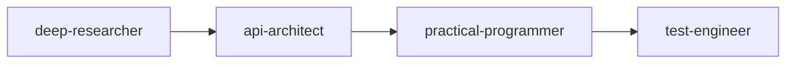
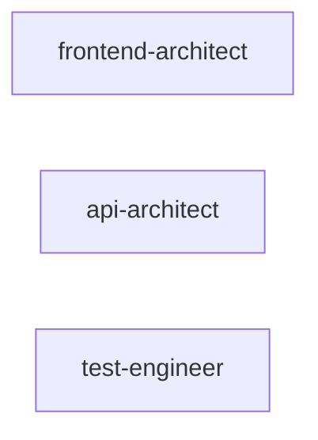
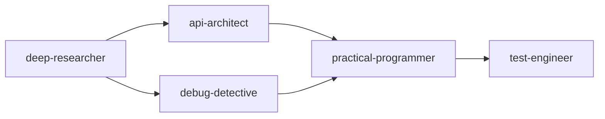
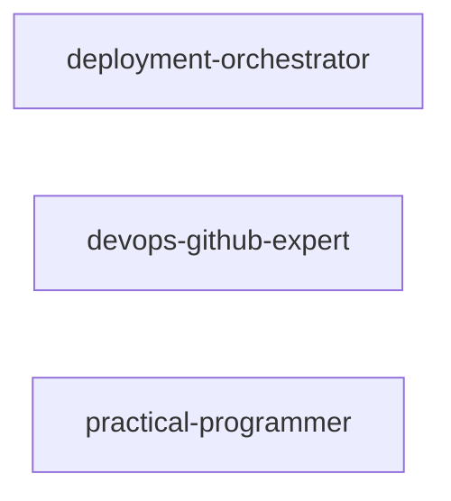
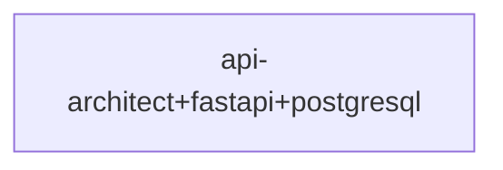
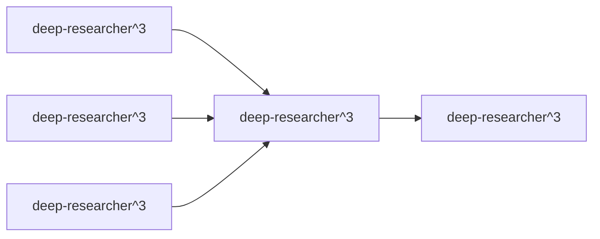
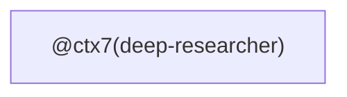
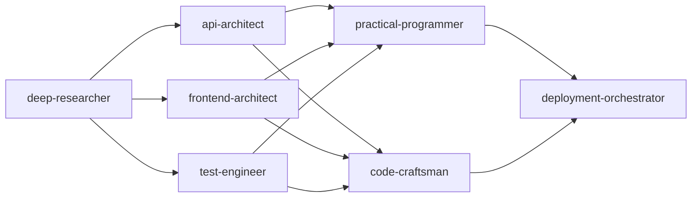
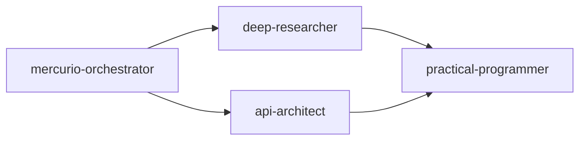

# HEKAT Orchestration Map

_Explicit mapping of multiple agentic orchestrations, generated by `build_orchestration_map.py`._

- **Workflows:** 9  (**9** compiled successfully)


## Summary

| Workflow | Pattern | Level | Nodes | Edges | Phases | Tokens |
|---|---|---|---|---|---|---|
| api-delivery-pipeline | Sequential | L6 | 4 | 3 | 4 | 2476 |
| fullstack-fanout | Parallel | L3 | 3 | 0 | 1 | 1028 |
| db-system-mixed | Mixed | L5 | 5 | 5 | 4 | 2808 |
| prod-deploy-fallback | Fallback | L3 | 3 | 0 | 1 | 1024 |
| user-service-skilled | Skilled | L1 | 1 | 0 | 1 | 620 |
| research-consensus-ensemble | Ensemble | L4 | 5 | 4 | 3 | 2284 |
| docs-commanded | Commanded | L1 | 1 | 0 | 1 | 630 |
| end-to-end-product | Mixed | L5 | 7 | 11 | 4 | 3172 |
| mercurio-synthesis | Mixed | L4 | 4 | 4 | 3 | 2181 |

## `api-delivery-pipeline`

```hekat
deep-researcher -> api-architect -> practical-programmer -> test-engineer : "design and ship a REST API"
```

- **Pattern:** Sequential  ·  **Complexity:** L6  ·  **Tokens:** 2476
- **Agents:** 4  ·  **Depth:** 4  ·  **Parallel:** False  ·  **Fallback:** False

**Execution phases (concurrent agents grouped):**

- Phase 0: deep-researcher
- Phase 1: api-architect
- Phase 2: practical-programmer
- Phase 3: test-engineer

**Explicit DAG edges (dependency → dependent):**

- `deep-researcher` → `api-architect`
- `api-architect` → `practical-programmer`
- `practical-programmer` → `test-engineer`

**Mermaid graph:**



## `fullstack-fanout`

```hekat
(frontend-architect || api-architect || test-engineer) : "build a full-stack feature in parallel"
```

- **Pattern:** Parallel  ·  **Complexity:** L3  ·  **Tokens:** 1028
- **Agents:** 3  ·  **Depth:** 1  ·  **Parallel:** True  ·  **Fallback:** False

**Execution phases (concurrent agents grouped):**

- Phase 0: frontend-architect, api-architect, test-engineer _(parallel)_

**Explicit DAG edges (dependency → dependent):**

- _(single node — no internal hand-offs)_

**Mermaid graph:**



## `db-system-mixed`

```hekat
deep-researcher -> (api-architect || debug-detective) -> practical-programmer -> test-engineer : "design and validate a database system"
```

- **Pattern:** Mixed  ·  **Complexity:** L5  ·  **Tokens:** 2808
- **Agents:** 5  ·  **Depth:** 4  ·  **Parallel:** True  ·  **Fallback:** False

**Execution phases (concurrent agents grouped):**

- Phase 0: deep-researcher
- Phase 1: api-architect, debug-detective _(parallel)_
- Phase 2: practical-programmer
- Phase 3: test-engineer

**Explicit DAG edges (dependency → dependent):**

- `deep-researcher` → `api-architect`
- `deep-researcher` → `debug-detective`
- `api-architect` → `practical-programmer`
- `debug-detective` → `practical-programmer`
- `practical-programmer` → `test-engineer`

**Mermaid graph:**



## `prod-deploy-fallback`

```hekat
deployment-orchestrator ? devops-github-expert ? practical-programmer : "deploy the service to production"
```

- **Pattern:** Fallback  ·  **Complexity:** L3  ·  **Tokens:** 1024
- **Agents:** 3  ·  **Depth:** 1  ·  **Parallel:** True  ·  **Fallback:** True

**Execution phases (concurrent agents grouped):**

- Phase 0: deployment-orchestrator, devops-github-expert, practical-programmer _(parallel)_

**Explicit DAG edges (dependency → dependent):**

- _(single node — no internal hand-offs)_

**Mermaid graph:**



## `user-service-skilled`

```hekat
api-architect + fastapi + postgresql : "design the user service API"
```

- **Pattern:** Skilled  ·  **Complexity:** L1  ·  **Tokens:** 620
- **Agents:** 1  ·  **Depth:** 1  ·  **Parallel:** False  ·  **Fallback:** False

**Execution phases (concurrent agents grouped):**

- Phase 0: api-architect+fastapi+postgresql

**Explicit DAG edges (dependency → dependent):**

- _(single node — no internal hand-offs)_

**Mermaid graph:**



## `research-consensus-ensemble`

```hekat
deep-researcher^3 ; merge ; synthesize : "reach consensus on system architecture"
```

- **Pattern:** Ensemble  ·  **Complexity:** L4  ·  **Tokens:** 2284
- **Agents:** 5  ·  **Depth:** 3  ·  **Parallel:** True  ·  **Fallback:** False

**Execution phases (concurrent agents grouped):**

- Phase 0: deep-researcher^3, deep-researcher^3, deep-researcher^3 _(parallel)_
- Phase 1: deep-researcher^3
- Phase 2: deep-researcher^3

**Explicit DAG edges (dependency → dependent):**

- `deep-researcher^3` → `deep-researcher^3`
- `deep-researcher^3` → `deep-researcher^3`
- `deep-researcher^3` → `deep-researcher^3`
- `deep-researcher^3` → `deep-researcher^3`

**Mermaid graph:**



## `docs-commanded`

```hekat
@ctx7(deep-researcher) : "fetch the latest framework documentation"
```

- **Pattern:** Commanded  ·  **Complexity:** L1  ·  **Tokens:** 630
- **Agents:** 1  ·  **Depth:** 1  ·  **Parallel:** False  ·  **Fallback:** False

**Execution phases (concurrent agents grouped):**

- Phase 0: @ctx7(deep-researcher)

**Explicit DAG edges (dependency → dependent):**

- _(single node — no internal hand-offs)_

**Mermaid graph:**



## `end-to-end-product`

```hekat
deep-researcher -> (api-architect || frontend-architect || test-engineer) -> (practical-programmer || code-craftsman) -> deployment-orchestrator : "end-to-end product build"
```

- **Pattern:** Mixed  ·  **Complexity:** L5  ·  **Tokens:** 3172
- **Agents:** 7  ·  **Depth:** 4  ·  **Parallel:** True  ·  **Fallback:** False

**Execution phases (concurrent agents grouped):**

- Phase 0: deep-researcher
- Phase 1: api-architect, frontend-architect, test-engineer _(parallel)_
- Phase 2: practical-programmer, code-craftsman _(parallel)_
- Phase 3: deployment-orchestrator

**Explicit DAG edges (dependency → dependent):**

- `deep-researcher` → `api-architect`
- `deep-researcher` → `frontend-architect`
- `deep-researcher` → `test-engineer`
- `api-architect` → `practical-programmer`
- `frontend-architect` → `practical-programmer`
- `test-engineer` → `practical-programmer`
- `api-architect` → `code-craftsman`
- `frontend-architect` → `code-craftsman`
- `test-engineer` → `code-craftsman`
- `practical-programmer` → `deployment-orchestrator`
- `code-craftsman` → `deployment-orchestrator`

**Mermaid graph:**



## `mercurio-synthesis`

```hekat
mercurio-orchestrator -> (deep-researcher || api-architect) -> practical-programmer : "multi-dimensional synthesis and build"
```

- **Pattern:** Mixed  ·  **Complexity:** L4  ·  **Tokens:** 2181
- **Agents:** 4  ·  **Depth:** 3  ·  **Parallel:** True  ·  **Fallback:** False

**Execution phases (concurrent agents grouped):**

- Phase 0: mercurio-orchestrator
- Phase 1: deep-researcher, api-architect _(parallel)_
- Phase 2: practical-programmer

**Explicit DAG edges (dependency → dependent):**

- `mercurio-orchestrator` → `deep-researcher`
- `mercurio-orchestrator` → `api-architect`
- `deep-researcher` → `practical-programmer`
- `api-architect` → `practical-programmer`

**Mermaid graph:**



## Aggregate cross-workflow map

**Agent usage (appearances across all orchestrations):**

- `api-architect`: 5
- `practical-programmer`: 5
- `deep-researcher^3`: 5
- `deep-researcher`: 4
- `test-engineer`: 4
- `frontend-architect`: 2
- `deployment-orchestrator`: 2
- `debug-detective`: 1
- `devops-github-expert`: 1
- `api-architect+fastapi+postgresql`: 1
- `@ctx7(deep-researcher)`: 1
- `code-craftsman`: 1
- `mercurio-orchestrator`: 1

**Agent hand-offs (edges aggregated across workflows):**

- api-architect -> practical-programmer: 4
- deep-researcher^3 -> deep-researcher^3: 4
- deep-researcher -> api-architect: 3
- practical-programmer -> test-engineer: 2
- deep-researcher -> debug-detective: 1
- debug-detective -> practical-programmer: 1
- deep-researcher -> frontend-architect: 1
- deep-researcher -> test-engineer: 1
- frontend-architect -> practical-programmer: 1
- test-engineer -> practical-programmer: 1
- api-architect -> code-craftsman: 1
- frontend-architect -> code-craftsman: 1
- test-engineer -> code-craftsman: 1
- practical-programmer -> deployment-orchestrator: 1
- code-craftsman -> deployment-orchestrator: 1
- mercurio-orchestrator -> deep-researcher: 1
- mercurio-orchestrator -> api-architect: 1
- deep-researcher -> practical-programmer: 1
